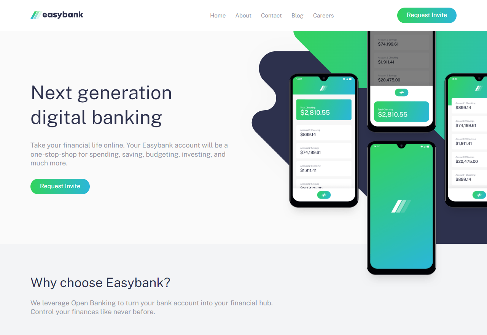

# Frontend Mentor - Easybank landing page solution

This is a solution to the [Easybank landing page challenge on Frontend Mentor](https://www.frontendmentor.io/challenges/easybank-landing-page-WaUhkoDN). Frontend Mentor challenges help you improve your coding skills by building realistic projects.

## Table of contents

- [Overview](#overview)
  - [The challenge](#the-challenge)
  - [Screenshot](#screenshot)
  - [Links](#links)
- [My process](#my-process)
  - [Built with](#built-with)
  - [What I learned](#what-i-learned)
  - [Continued development](#continued-development)
- [Author](#author)
- [Acknowledgments](#acknowledgments)

**Note: Delete this note and update the table of contents based on what sections you keep.**

## Overview

### The challenge

Users should be able to:

- View the optimal layout for the site depending on their device's screen size
- See hover states for all interactive elements on the page

### Screenshot

### Links

- Solution URL: [Github](https://github.com/souravone/easybank-new.io)
- Live Site URL: [Github Page](https://github.com/souravone/easybank-new.io)

## My process

### Built with

- Semantic HTML5 markup
- CSS custom properties
- Flexbox
- CSS Grid
- SCSS
- Desktop-first workflow
- Basic JS

### What I learned

- Better use of html elements
- Using of SVG images

### Continued development

I'd like to make this site more responsive, and also would like to position images better.

## Author

- Website - [Sourav Das](https://github.com/souravone)
- Frontend Mentor - [@souravone](https://www.frontendmentor.io/profile/souravone)
- Twitter - [@das*dev*](https://twitter.com/das_dev_)

## Acknowledgments

This is where you can give a hat tip to anyone who helped you out on this project. Perhaps you worked in a team or got some inspiration from someone else's solution. This is the perfect place to give them some credit.

I'd like to thank Grace from [Frontend Mentor](https://www.frontendmentor.io), her valuable feedback helped me very much to shape this landing page.
